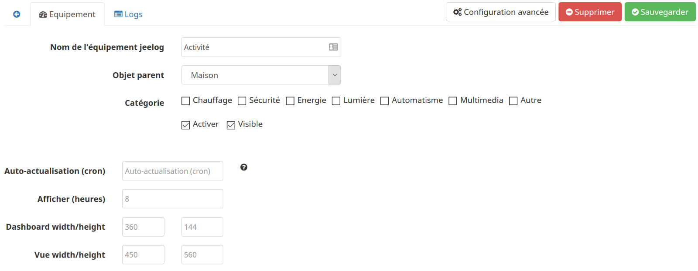
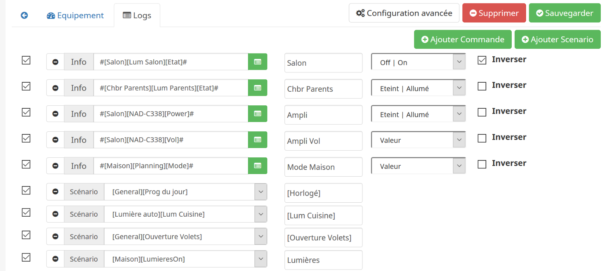

# JeeLog - Plugin pour Jeedom

Plugin de visualisation globale d'activité Jeedom (équipements / scénarios)

## Configuration du plugin JeeLog

Après installation du plugin, il vous suffit de l’activer.
Il apparaitra alors dans le menu *Plugins > Monitoring*

## Ajouter un log
Cliquez simplement sur Ajouter, puis nommez votre équipement log.

  

Vous pouvez également paramétrer:
- un cron d’auto-actualisation.
- Le nombre d'heures à afficher. Par défaut, le log affichera l'activité sur les 8 dernières heures.
- Les hauteur/largeur des tuiles Dashboard et Vue. Ce qui permet d'avoir une tuile plus grande sur une vue, afin de ne pas prendre trop de place sur le Dashboard.

### Onglet *Logs*

Une fois l'équipement crée, allez sur l'onglet *Logs* pour paramétrer ce que le log va afficher.

C'est ici que vous allez ajouter les commandes info et les scénarios que vous souhaitez.

Vous retrouvez donc:
- une option pour activer ou non cette info/scénario.
- l'info/scénario à logger.
- Le nom sous lequel cela apparaitra dans le log.
- Pour les infos, le type d'info (lumière, porte, etc).
- Pour les infos, une option pour inverse ce type.

Vous pouvez monter/descendre les éléments de cette liste pour plus de clarté (drag/drop).

- Pour que ces commandes apparraissent dans votre log, il faut qu'elles soient historisées sur la période. De la même manière que pour les voir dans *Analyse > Historique*.
- L'affichage des scénarios se fait par le log de chaque scénario demandé. Si le log est vidé, il n'apparaitra donc plus.

  

## Affichage

Voici quelques illustrations du résultat, avec les paramètres par défaut.

Dashboard:

  

Vue:

  

Vue sur mobile:

  

## Changelog

[Voir la page dédiée](changelog.md).

