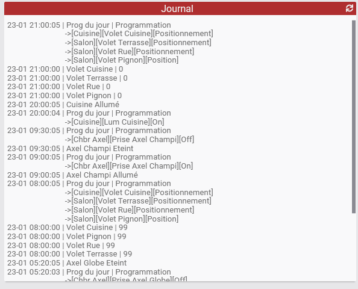

# JeeLog - Plugin pour Jeedom

Plugin de visualisation globale d'activité Jeedom (équipements / scénarios)

## Configuration du plugin JeeLog

Après installation du plugin, il vous suffit de l’activer.
Il apparaitra alors dans le menu *Plugins > Monitoring*

## Ajouter un log
Cliquez simplement sur Ajouter, puis nommez votre équipement log.

  

Vous pouvez également paramétrer:
- Un cron d’auto-actualisation.
- Afficher Mise à jour : Ajoute une ligne en haut du log avec l'heure de mise à jour.
- Détails des scénarios : Affiche, en plus du déclenchement du scénario, les actions lancées par celui-ci.
- Le nombre d'heures à afficher. Par défaut, le log affichera l'activité sur les 8 dernières heures.
- Le format de date en début de chaque ligne du log (au format php):
    - [Doc php](http://php.net/manual/fr/function.date.php)
    - Si vous voulez seulement l'heure en début de ligne de log : H:i:s
    - Pour seulement jour-mois heure : d-m H:i:s
- Les hauteur/largeur des tuiles Dashboard et Vue. Ce qui permet d'avoir une tuile plus grande sur une vue, afin de ne pas prendre trop de place sur le Dashboard.
- Les couleurs de fond et de texte au format css pour la tuile Design. Par ex, pour un fond transparent, indiquez rgba(0,0,0,0) !

### Onglet *Logs*

Une fois l'équipement crée, allez sur l'onglet *Logs* pour paramétrer ce que le log va afficher.

C'est ici que vous allez ajouter les commandes info et les scénarios que vous souhaitez.

Vous retrouvez donc:
- Import infos : Ouvre une fenêtre listant toutes vos commandes infos avec option de recherche, pour en importer plusieurs à la volée.
- Une option pour activer ou non cette info/scénario.
- L'info/scénario à logger.
- Le nom sous lequel cela apparaitra dans le log.
- Pour les commandes info:
  - Le type d'info (Eteint/Allumé, Fermeture/Ouverture, Presence, Valeur). Pour des volets, ou le plugin Mode, utilisez Valeur.
  - Une option pour inverser ce type.
  - Une option pour ne pas répéter la valeur dans le log si elle ne change pas.

Vous pouvez monter/descendre les éléments de cette liste pour plus de clarté (drag/drop).

- Pour que ces commandes apparraissent dans votre log, il faut qu'elles soient historisées sur la période. De la même manière que pour les voir dans *Analyse > Historique*.
- L'affichage des scénarios se fait par le log de chaque scénario demandé. Si le log est vidé, il n'apparaitra donc plus.

  

## Affichage

Voici quelques illustrations du résultat, avec les paramètres par défaut.

Dashboard:

  

Vue:

  

Vue sur mobile:

  

## Changelog

[Voir la page dédiée](changelog.md).

